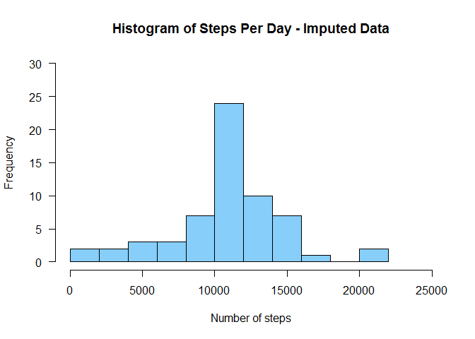

# Reproducible Research: Peer Assessment 1

###Loading and preprocessing the data

```r
require(lattice)
```

```
## Loading required package: lattice
```

```r
options(scipen=999)   # Prevent numbers from display in scientific notation

# The data file is part of the cloned repository, so no need to download.
unzip('activity.zip', overwrite=TRUE)
activityData.raw <- read.csv('activity.csv', 
                             colClasses=c("integer", "Date", "integer"))
activityData.cleaned <- na.omit(activityData.raw)
```
###What is mean total number of steps taken per day?
**Make a histogram of the total number of steps taken each day**

```r
# Calculate the total number of steps taken per day
stepsPerDay <- by(activityData.cleaned$steps, activityData.cleaned$date, sum)

# Plot the histogram of the data
hist(stepsPerDay, 15, las=1, 
     xlim=c(0,25000), ylim=c(0,30), col="lightskyblue",
     main='Histogram of Steps Per Day',
     xlab='Number of steps per day')
```

 

**Calculate and report the mean and median total number of steps taken
per day.**

The mean total steps per day is 10,766.19 steps.  The median total steps per day is 10,765 steps.  


###What is the average daily activity pattern?
**Make a time series plot (i.e. type = "l" ) of the 5-minute interval (x-axis)
and the average number of steps taken, averaged across all days (y-axis)**

```r
# Calculate the mean for each interval & plot
avgDailyPattern <- by(activityData.cleaned$steps, activityData.cleaned$interval, mean)
plot(unique(activityData.cleaned$interval),avgDailyPattern, 
     type='l', col='blue', las=1,
     main='Average Daily Activity Pattern',
     xlab='5-minute Time interval', ylab='No. of Steps')
```

 

```r
# Find the maximum value, and the interval in which it occurs
maxIntervalIndex <- max(avgDailyPattern)
maxInterval <- activityData.cleaned$interval[which(avgDailyPattern==maxIntervalIndex)]
```

**Which 5-minute interval, on average across all the days in the dataset,
contains the maximum number of steps?**

The maximum number of steps in an interval is 206.1698113, and occurs in interval 835.  


###Imputing missing values
Note that there are a number of days/intervals where there are missing values
(coded as NA ). The presence of missing days may introduce bias into some
calculations or summaries of the data.  

```r
# Find the missing rows
missingRows <- !complete.cases(activityData.raw)
numRowsMissingData <- sum(missingRows)

missingIndices <- which(missingRows, arr.ind=TRUE)

# Fill in the missing data
for (i in missingIndices) {
  indexName <- as.character(activityData.raw[i, 'interval'])
  activityData.raw[i, 'steps'] <- avgDailyPattern[indexName]
}

# Calculate the total number of steps taken per day
stepsPerDayImputed <- by(activityData.raw$steps, activityData.raw$date, sum)
```

**1. Calculate and report the total number of missing values in the dataset
(i.e. the total number of rows with NAs)**

There are 2,304 rows with missing values in the dataset.  

**2. Devise a strategy for filling in all of the missing values in the dataset. The
strategy does not need to be sophisticated. For example, you could use
the mean/median for that day, or the mean for that 5-minute interval, etc.**

Missing values in the dataset will be filled with the corresponding mean value for the
5-minute interval.  

**3. Create a new dataset that is equal to the original dataset but with the
missing data filled in.**


```r
head(activityData.raw)
```

```
##       steps       date interval
## 1 1.7169811 2012-10-01        0
## 2 0.3396226 2012-10-01        5
## 3 0.1320755 2012-10-01       10
## 4 0.1509434 2012-10-01       15
## 5 0.0754717 2012-10-01       20
## 6 2.0943396 2012-10-01       25
```

**4. Make a histogram of the total number of steps taken each day and Calculate
and report the mean and median total number of steps taken per day.**


```r
# Plot the histogram with imputed data
hist(stepsPerDayImputed, 15, las=1, 
     xlim=c(0,25000), ylim=c(0,30), col="lightskyblue", 
     main='Histogram of Steps Per Day - Imputed Data',
     xlab='Number of steps')
```

 

```r
# Calculate mean & median values for comparison of the raw & imputed data sets
dfStats <- data.frame(Mean=c(mean(stepsPerDay), mean(stepsPerDayImputed)), 
           Median=c(median(stepsPerDay), median(stepsPerDayImputed)), 
           row.names=c('Raw Data', 'Imputed Data'))

dfStats
```

```
##                  Mean   Median
## Raw Data     10766.19 10765.00
## Imputed Data 10766.19 10766.19
```

**Do these values differ from the estimates from the first part of the assignment?**

The mean value is the same for the original and imputed data.  The median value of the imputed data shifted toward the mean value.  

**What is the impact of imputing missing data on the estimates of the total
daily number of steps?**

Imputing data may affect statistics of the data, if not done carefully.  Since the mean values for each 5-minute interval were used to impute the data, the mean was not affected.  However, since this process added new values at the mean of each interval, the median value was shifted toward the mean.  

###Are there differences in activity patterns between weekdays and weekends?
**1. Create a new factor variable in the dataset with two levels - "weekday"
and "weekend" indicating whether a given date is a weekday or weekend
day.**

```r
# Add levels to the data frame indicating weekday or weekend
activityData.raw$dow <- NA
dayList <- weekdays(activityData.raw$date)
weekendIndices <- which(dayList=="Sunday" | dayList=="Saturday", arr.ind=TRUE)
weekdayIndices <- which(dayList!="Sunday" & dayList!="Saturday", arr.ind=TRUE)
activityData.raw$dow[weekendIndices] <- 'weekend'
activityData.raw$dow[weekdayIndices] <- 'weekday'
activityData.raw$dow <- as.factor(activityData.raw$dow)
summary(activityData.raw)
```

```
##      steps             date               interval           dow       
##  Min.   :  0.00   Min.   :2012-10-01   Min.   :   0.0   weekday:12960  
##  1st Qu.:  0.00   1st Qu.:2012-10-16   1st Qu.: 588.8   weekend: 4608  
##  Median :  0.00   Median :2012-10-31   Median :1177.5                  
##  Mean   : 37.38   Mean   :2012-10-31   Mean   :1177.5                  
##  3rd Qu.: 27.00   3rd Qu.:2012-11-15   3rd Qu.:1766.2                  
##  Max.   :806.00   Max.   :2012-11-30   Max.   :2355.0
```
**2. Make a panel plot containing a time series plot (i.e. type = "l" ) of the
5-minute interval (x-axis) and the average number of steps taken, averaged
across all weekday days or weekend days (y-axis).**


```r
avgDailyPatternNew <- by(activityData.raw$steps, list(activityData.raw$interval, activityData.raw$dow), mean, simplify=TRUE)

dfAvgDailyPatternNew<-data.frame(interval=as.numeric(as.character(names(avgDailyPatternNew[,'weekday']))), steps=avgDailyPatternNew[,'weekday'], dow='weekday')

dfAvgDailyPatternNew<-rbind(dfAvgDailyPatternNew, data.frame(interval=as.numeric(as.character(names(avgDailyPatternNew[,'weekend']))), steps=avgDailyPatternNew[,'weekend'],dow='weekend'))
         
xyplot(dfAvgDailyPatternNew$steps ~ dfAvgDailyPatternNew$interval | dfAvgDailyPatternNew$dow, type='l', layout=c(1,2),
       main='Average Daily Steps Patterns, by Interval, on Weekends and Weekdays',
       xlab='5-minute Time interval', ylab='No. of Steps')
```

 

```r
# Calculate the average total daily steps for weekdays & weekends for the summary 
avgDailyStepsDow <- by(dfAvgDailyPatternNew$steps, dfAvgDailyPatternNew$dow, sum)
stepCountDiff <- abs(avgDailyStepsDow[1] - avgDailyStepsDow[2])
```
**Summary**
There are differences in activity patterns between weekdays and weekends.  Weekdays show a pattern of early morning activity, with a few spikes throughout the day, whereas weekends show a lower, but more sustained level of activity throughout the day.  The difference in average total steps per day for the data period was 1,946 steps, with an average total of 10,256 steps taken on weekdays versus an average total of 12,202 steps taken on weekends.

